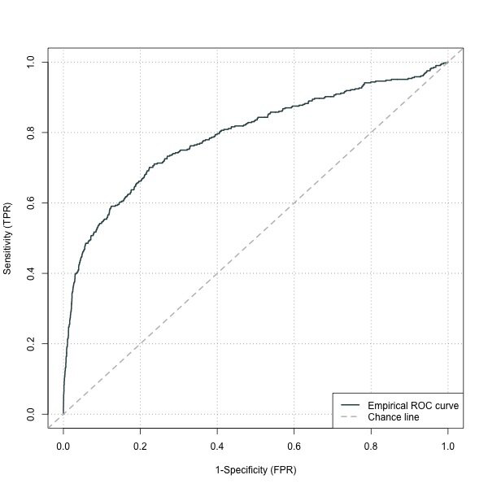
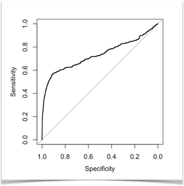

[](http://quantlet.de/)

## [](http://quantlet.de/) **DEDA_SVM_P2P** [](http://quantlet.de/)

```yaml

Name of QuantLet : DEDA_SVM_P2P

Published in : 'DEDA Unit 7: Support Vector Machines (SVM)'

Description : 'SVM classification model for defaults of P2P loans. Compares the out-of-sample predictive performance to a baseline logistic regression model.'

Keywords : Support vector machines, SVM, classification

See also : 'DEDA_SVM_Linear, DEDA_SVM_Nonlinear, DEDA_SVM_Spiral'

Author : Georg Keilbar

Submitted : May 26 2019 by Georg Keilbar

```





### R Code
```r

# clear all variables
rm(list = ls(all = TRUE))
graphics.off()

# install and load packages
libraries = c("caret","LogicReg","e1071","pROC")
lapply(libraries, function(x) if (!(x %in% installed.packages())) {
  install.packages(x)
})
lapply(libraries, library, quietly = TRUE, character.only = TRUE)

# set the working directory
setwd("~/Desktop/IRTG/Presentations/SVM")

# Read in data
data = read.csv("p2p.csv")
data$status = factor(data$status)

# Split into training and test data
set.seed(1234)
ind = createDataPartition(y=data$status, p=0.75, list=F)
train = data[ind,]
test = data[-ind,]

# Logistic regression
fit_log = glm(status~ratio002 + ratio003 + ratio004 + ratio005 + ratio006 + 
                ratio011 + ratio012 + DPO + DSO + turnover + ratio036 + ratio037 + 
                ratio039 + ratio040,family="binomial",data=train)
pre_log = as.numeric(predict(fit_log,newdata=test,type="response"))
class_log = factor(ifelse(pre_log>0.5,1,0))

# SVM
ctrl = trainControl(classProbs = T)#,method = "repeatedcv", number = 10, repeats = 3)
fit_svm_prob = train(status~ratio002 + ratio003 + ratio004 + ratio005 + ratio006 + 
                       ratio011 + ratio012 + DPO + DSO + turnover + ratio036 + ratio037 + 
                       ratio039 + ratio040,data=train,method="svmRadial",trConrol=ctrl,prob.model=TRUE)
fit_svm_class = train(status~ratio002 + ratio003 + ratio004 + ratio005 + ratio006 + 
                        ratio011 + ratio012 + DPO + DSO + turnover + ratio036 + ratio037 + 
                        ratio039 + ratio040,data=train,method="svmPoly",trConrol=ctrl)
class_svm = predict(fit_svm_class,newdata=test)
pre_svm = predict(fit_svm_prob,newdata=test,type="prob")

# Confusion matrix
confusionMatrix(class_svm,test$status)
confusionMatrix(class_log,test$status)

# ROC curve
plot(roc(test$status,pre_log))
plot(roc(test$status,pre_svm[,1]))

```

automatically created on 2019-05-26