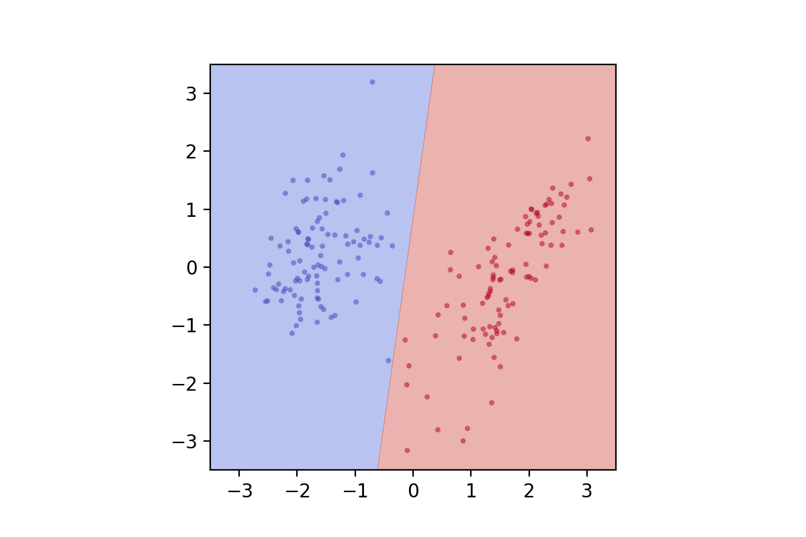

[](http://quantlet.de/)

## [](http://quantlet.de/) **DEDA_SVM_Swiss_PC** [](http://quantlet.de/)

```yaml

Name of QuantLet : DEDA_SVM_Swiss_PC

Published in : 'DEDA Unit 7: Support Vector Machines (SVM)'

Description : 'Determines and plots the decision boundary of a SVM classifier with linear kernel using the first 2 principal components of the Swiss banknote dataset.'

Keywords : Support vector machines, SVM, classification, principal components, PC

See also : 'DEDA_SVM_Linear, DEDA_SVM_Nonlinear, DEDA_SVM_Spiral, DEDA_SVM_Swiss'

Author : Georg Keilbar

Submitted : October 19 2018 by Georg Keilbar

```



### PYTHON Code
```python

import numpy as np
from numpy import genfromtxt
import matplotlib.pyplot as plt
from sklearn import svm
from sklearn.decomposition import PCA

#Load data
swiss = genfromtxt('swiss.txt', delimiter='', skip_header=1)

Y = swiss[:,1]
X = swiss[:,2:8]

pca = PCA(n_components=2)
PC = pca.fit_transform(X)

#Simple scatterplot
plt.scatter(X[:,0],X[:,1],c=Y,cmap='bwr',s=4)


def plot_svm_nonlinear(x, y, model_class, **model_params):
    #Fit model
    model = model_class(**model_params)
    model.fit(x, y)
    
    #Define grid
    h = .001  
    x_min, x_max = x[:, 0].min() - 0.2, x[:, 0].max() + 0.2
    y_min, y_max = x[:, 1].min() - 0.2, x[:, 1].max() + 0.2
    xx, yy = np.meshgrid(np.arange(x_min, x_max, h), np.arange(y_min, y_max, h))
    
    #Prediction on grid
    Z = model.predict(np.c_[xx.ravel(), yy.ravel()]).reshape(xx.shape)

    #Contour + scatter plot
    plt.contourf(xx, yy, Z, alpha=0.4, cmap='coolwarm')
    plt.scatter(x[:, 0], x[:, 1], c=y, alpha=0.4, cmap='bwr',s=4)
    #plt.gca().set_aspect('equal', adjustable='box')

    return plt

plot_svm_nonlinear(PC,Y,svm.SVC,C=10,kernel='linear',degree=2)
plt.savefig('swiss_pc.png', transparent=True, dpi=200)
plt.clf()
```

automatically created on 2018-10-30